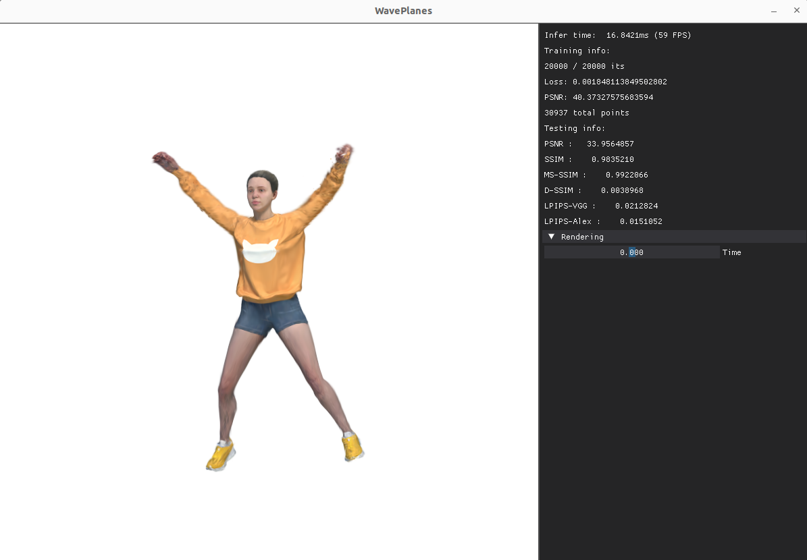

# WavePlanes: A compact Wavelet representation for Dynamic Neural Radiance Fields
Code release for:

> __WavePlanes: A compact Wavelet representation for Dynamic Neural Radiance Fields__
>
> [Adrian Azzarelli*](https://www.bristol.ac.uk/people/person/Adrian-Azzarelli-e2aebee2-db4d-449f-b0dd-c3548eecb524/), [Nantheera Anantrasirichai](https://www.bristol.ac.uk/people/person/Pui-Anantrasirichai-49b2250e-53e4-4631-aedc-8154b2cff568/), [David R Bull](https://www.bristol.ac.uk/people/person/David-Bull-f53987d8-4d62-431b-8228-2d39f944fbfe/)

:lemon: [Project page](https://azzarelli.github.io//waveplanespage/index.html)
:writing_hand: [Paper](https://arxiv.org/abs/2312.02218)


## What is this branch?

As Gaussian Splatting has become popular, we implement a reduced version of the WavePlanes model on the [4DGaussians](https://github.com/hustvl/4DGaussians) model. Its reduced because we don't include the compression functionality as it didn't make much sense (model size limitations relate more to the large point clouds, only the hex-plane feature decoders). 

Specifically we make minor modifications:
 
1. Adding `scene.waveplane.py` (using WavePlanes instead of HexPlane decomposition)
2. Updating `scene.gaussian_model.py` regularization functions to reflect the structure of the GridSet
3. Add a live GUI (`gui.py`) using [dearpygui library](https://github.com/hoffstadt/DearPyGui) to view the scene, training and testing results in real-time

## Setup 

1. Follow installation steps from [4DGaussians](https://github.com/hustvl/4DGaussians)
2. Install `pytroch_wavelets_` as done in the `main` branch
3. Pip-Install [dearpygui](https://github.com/hoffstadt/DearPyGui) 

## New Commands

To train and view testing results:
```
python gui.py -s data/dnerf/jumpingjacks --gui --port 6017 --expname "dnerf/jumpingjacks" --configs arguments/dnerf/jumpingjacks.py 
```

Note that during training only PSNR and SSIM are tested. For MS-SSIM, D-SSIM, LPIPS-VGG and LPIPS-Alex you need to wait untill training is completed.

## Compression

Not implemented (this branch is just to share BTS development) but I can upon request.

## Viewer Example


